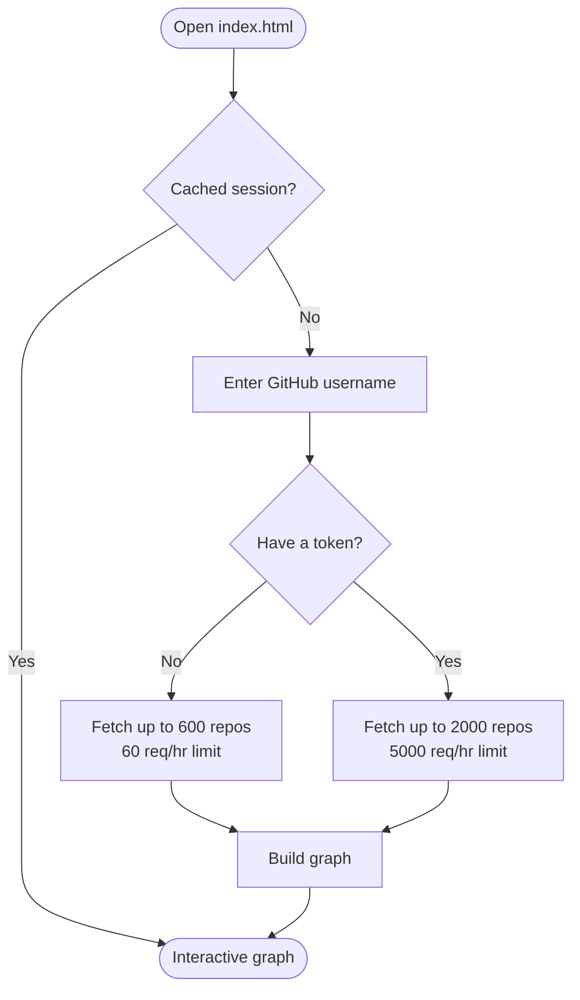
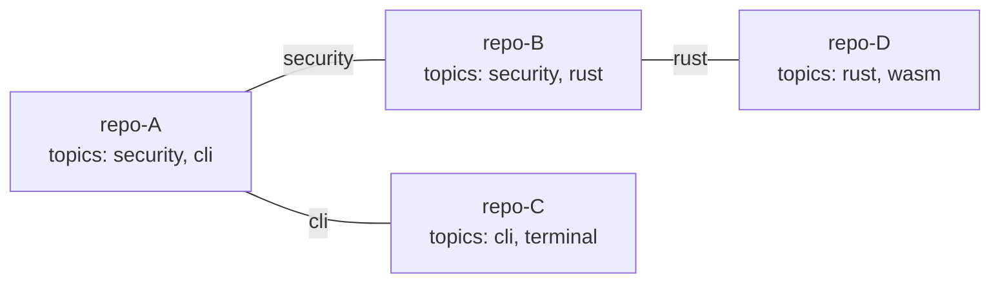
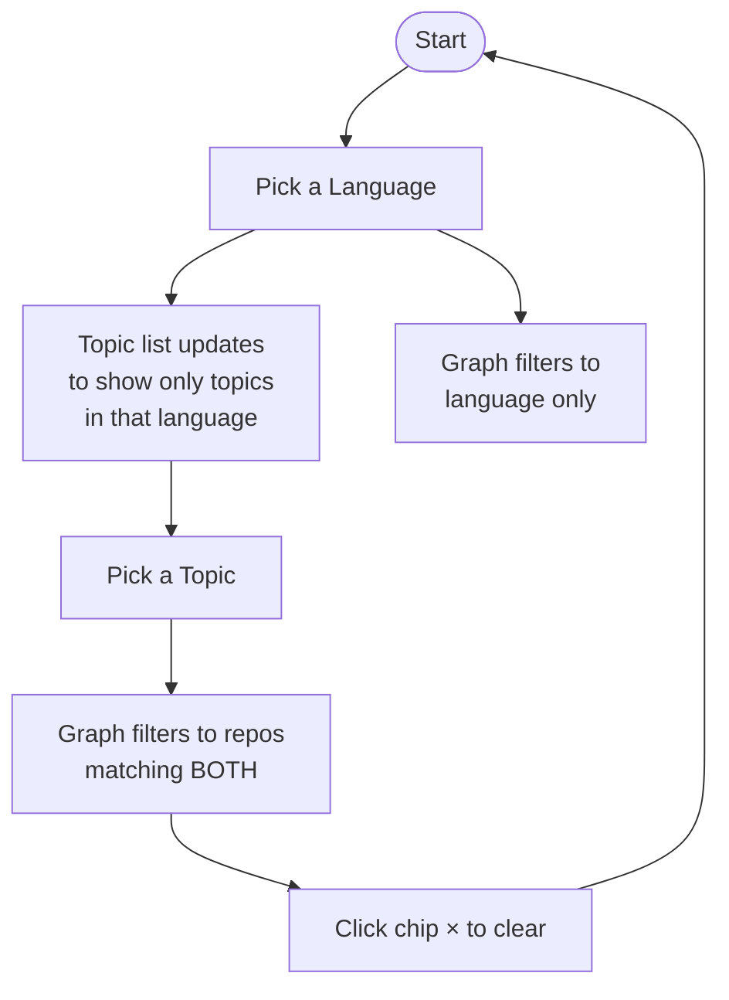
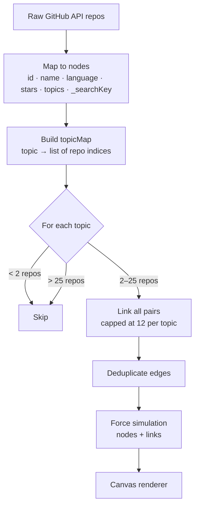

# Stargaze

> Turn your GitHub starred repositories into an interactive knowledge graph — clustered by shared topics, colored by language.

No server. No build step. Open `index.html` and go.

---

## Quick Start

1. Open `index.html` in any modern browser
2. Enter a GitHub username
3. *(Optional)* Paste a GitHub token to load up to 2000 repos
4. Click **Build Graph →**

Your graph is cached locally — **refreshing the page restores it instantly** without re-fetching from GitHub. Use the **↻ Re-fetch** button in the header to pull fresh data.



### GitHub Token

A token is optional but recommended for users with many stars. It only raises the API rate limit — **no scopes needed**.

Generate one at [github.com/settings/tokens](https://github.com/settings/tokens):
- **Classic token** — leave all checkboxes unchecked
- **Fine-grained token** — no extra permissions needed

---

## Understanding the Graph

### Nodes

Each **node** is one starred repository.

| Visual property | Meaning |
|---|---|
| Color | Programming language |
| Size | Star count (logarithmic scale, range 4–10 px) |
| Label | Repository name (hidden below 25% zoom) |

### Edges

Two repos are connected by an edge when they **share a topic tag**.



Edge generation rules:
- A topic must appear in **2–25 repos** to create edges (1 repo = nothing to connect; 26+ = too many edges)
- Each topic connects at most **12 repos** to each other to prevent hairballs
- Repos with **no topics** have no edges and float as isolated nodes

### Layout

The graph uses a D3 force simulation. Nodes that share many topics cluster together naturally. Hub nodes (many connections) spread further apart due to degree-aware link distance.

---

## Navigating the Graph

| Action | How |
|---|---|
| Zoom in / out | Scroll wheel, or **+** / **−** buttons |
| Fit all nodes | **⊡** button (bottom-right) |
| Pan | Click and drag on empty canvas |
| Move a node | Drag the node itself |
| Open repo details | Click a node |
| Close details | Click empty canvas, or **×** in the panel |
| Refresh data | **↻ Re-fetch** button in the header |
| Back to search | **← Reset** button (clears cache) |

---

## Filtering & Search



### Language filter

Click any language in the left sidebar column. The graph immediately filters to repos of that language. The active language appears as a **chip** in the top-left corner of the canvas — click **×** to clear it.

### Topic filter

Topic list is **dependent on the selected language** — pick a language first. The topic list then shows only topics that appear in repos of that language, with counts. Combining language + topic uses **AND logic** (repo must match both).

### Search bar

The search box (top bar) filters nodes in real time across:
- Repository name
- Description
- Topics
- Language
- Full name (`owner/repo`)

Search works independently of the language/topic filters — all three stack together.

---

## Session Persistence

Repo data is cached in `localStorage` after every successful fetch. On refresh the graph loads instantly from cache with no API calls.

- **↻ Re-fetch** — forces a fresh fetch from GitHub and updates the cache
- **← Reset** — clears the cache and returns to the landing page

Cache is stored in a compact format (short keys, descriptions truncated to 120 chars, `html_url` and `owner` reconstructed from `full_name`) to stay well within the browser's 5 MB localStorage limit even for 2000 repos.

---

## File Structure

```
index.html          — markup only (loading overlay, landing, app)
css/
  base.css          — CSS variables, reset, app shell, loading overlay
  landing.css       — landing page
  header.css        — top bar
  sidebar.css       — filters, chips, stats, toggles
  canvas.css        — canvas area, zoom controls
  detail.css        — repo detail panel
  tooltip.css       — hover tooltip
js/
  config.js         — language colors, helper functions
  state.js          — shared mutable state
  api.js            — GitHub fetch, localStorage cache, graph data construction
  sidebar.js        — filter lists, active chips, topic list
  tooltip.js        — hover tooltip
  detail.js         — repo detail panel
  renderer.js       — Canvas 2D drawing, force simulation, zoom, drag
  events.js         — event wiring, session auto-restore
```

---

## How the Graph is Built



---

## Performance Notes

- Renders with **Canvas 2D**, not SVG — handles 1000+ nodes smoothly
- Canvas context uses `alpha: false` — browser skips alpha compositing since background is always solid
- Simulation is **pre-warmed** synchronously before first paint so the graph appears settled
- Hit detection uses a **D3 quadtree** (O log n) instead of checking every node on hover
- Zoom redraws are **throttled via `requestAnimationFrame`** — at most one frame rendered per screen refresh regardless of scroll speed
- Nodes, links, and labels are **viewport-culled** — off-screen elements are skipped each frame
- Tick rendering is **skipped every 2nd/3rd frame** for graphs with 300+ nodes
- Labels skip `ctx.shadowBlur` (expensive) and are hidden below 25% zoom scale
